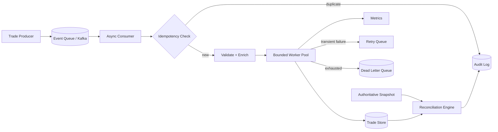

# Distributed Trade Engine (Python)

A clean-room portfolio project demonstrating how to design a resilient, high-throughput event-processing platform for trade workflows.

## Why this project exists

Financial systems rarely fail because a CRUD endpoint is hard to write. The difficult parts are concurrency, duplicate delivery, retries, ordering, reconciliation, backpressure, and proving that the final state is correct.

This project focuses on those problems directly.

## Core engineering challenges

- Idempotent processing under at-least-once delivery
- Bounded concurrency and backpressure
- Retry with exponential backoff
- Dead-letter handling for poison events
- Deterministic reconciliation against an authoritative snapshot
- Explicit trade state transitions
- Graceful shutdown without dropping in-flight work
- Metrics and auditability

## Architecture



## Project structure

```text
app/
  models.py          domain model and state machine
  engine.py          bounded async processing engine
  repository.py      idempotent in-memory repository abstraction
  retry.py           retry policy
  reconciliation.py  snapshot reconciliation
  main.py            runnable demo

tests/
  test_engine.py
  test_reconciliation.py
```

## Design decisions

### 1. At-least-once delivery, not wishful exactly-once processing

The engine assumes an event may be delivered more than once. Each event carries an immutable `event_id`, and persistence is guarded by an idempotency check. Duplicate events are acknowledged without reapplying side effects.

### 2. Bounded parallelism

`asyncio.Semaphore` limits the number of concurrently processed trades. This prevents an upstream spike from turning into unbounded memory growth or database saturation.

### 3. State transitions are explicit

Trades move through a small state machine rather than arbitrary string updates:

`RECEIVED -> VALIDATED -> ENRICHED -> SETTLED`

Failures are represented explicitly as `FAILED`.

### 4. Reconciliation is a first-class capability

Streaming pipelines can miss data, replay data, or receive events out of order. A periodic authoritative snapshot compares expected state against the operational store and identifies:

- missing trades
- stale trades
- unexpected trades

This is a realistic enterprise pattern for recovering correctness independently of the event stream.

## Run locally

Requires Python 3.11+.

```bash
python -m app.main
```

Run tests:

```bash
python -m unittest discover -s tests -v
```

## What I would add for production

- Kafka via `aiokafka`
- PostgreSQL with transactional outbox/inbox tables
- OpenTelemetry traces and Prometheus metrics
- Schema Registry / versioned event contracts
- Partitioning strategy by account or instrument
- Kubernetes deployment with graceful termination hooks
- Load tests capturing throughput, p95/p99 latency, retry rate, and queue depth

## Interview discussion points

This project is intentionally useful as a system-design artifact. Good follow-up questions include:

- Why not claim exactly-once processing?
- What key should Kafka partition on?
- How would you avoid a hot partition?
- Where should idempotency state live?
- How do retries affect event ordering?
- How would you reconcile millions of rows efficiently?
- How would you drain in-flight work during deployment?

## Disclaimer

This is an original clean-room project. It demonstrates general distributed-systems patterns and does not contain proprietary employer code, data, or architecture.
